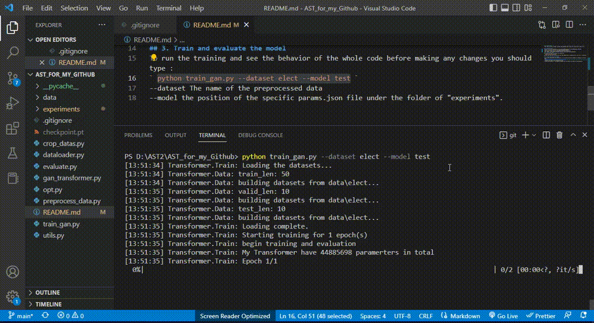

## 0. Indications
This repo is based on https://github.com/hihihihiwsf/AST repo with correction of some errors.

## 1. Download data
electricity: https://archive.ics.uci.edu/ml/datasets/ElectricityLoadDiagrams  
traffic: https://archive.ics.uci.edu/ml/datasets/PEMS-SF  
solar data： https://www.nrel.gov/grid/solar-power-data.html  
wind: https://www.kaggle.com/sohier/30-years-of-european-wind-generation   
## 2. Preprocess data
To process the data, you must first type this  
` python preprocess_data.py ` or ` python preprocess_data.py --data-folder NAME_OF_YOUR_DATA_DIR`  
But you can skip this step and just use the reduced data (`.npy`) I placed in the `/data/elect` directory.  
As you can see, in my case, `NAME_OF_YOUR_DATA_DIR="data"`.  

## 3. Train and evaluate the model
To run the training and see the behavior of the whole code before making any changes you should type :  
` python train_gan.py --dataset elect --model test `  
--dataset The name of the preprocessed data  
--model the position of the specific params.json file under the folder of "experiments".  
In general, you can do for exemple :  
` python train_gan.py --dataset DATASET_NAME --model EXPERIMENTS_SUBDIR_CONTAINING_PARAMETERS_JSON `  
After that, you can use the model by tape :  
`python usage.py --usage-fig DIR_THAT_WILL_RECEIVE_RESULTS `  
if you do not specify this parameter (the directory that will receive the results), it will be by default, `figures`. If that directory doesn't exist, il will automatically created.

## 4. Illustration (Training-output)
Output should look like this... 
  

## 5. More information about the installation and training specifications  
To install pytorch properly, you may to visit : https://pytorch.org/get-started/locally/ .  
To use `GPU`, you can for exemple replace `"cpu"` by `"cuda"` in `experiments/test/params.json` file (with the assumption that the machine used supports CUDA).